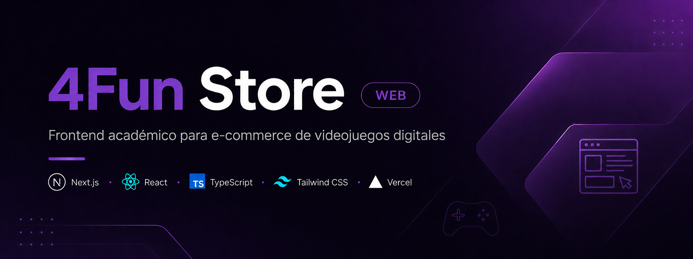

# 4Fun Store Web

<p align="center">
  
</p>

<p align="center">
  
  
  
  
  
</p>

---

## Links rápidos

- **Web desplegada**: https://4fun-store-web.vercel.app
- **API desplegada**: https://4fun-store-api.vercel.app
- **Verificación de estado (Health check)**: https://4fun-store-api.vercel.app/health
- **Acta M6**: [docs/m6-acta-entrega-final.md](docs/m6-acta-entrega-final.md)
- **Entrega académica final**: `v1.0.0-thesis`

---

Cliente web de **4Fun Store**, sistema e-commerce académico orientado a la venta de videojuegos digitales. Este repositorio contiene la versión final entregable de la tesis, incluyendo interfaz de usuario, catálogo, autenticación, carrito, checkout, panel administrativo básico e historial de compras.

## Estado académico final

| Item                                          | Estado                                   |
| :-------------------------------------------- | :--------------------------------------- |
| Versión académica                             | `v1.0.0-thesis`                          |
| Rama final consolidada                        | `main`                                   |
| Rama de trazabilidad funcional                | `tesis/flujo-principal`                  |
| Despliegue frontend                           | https://4fun-store-web.vercel.app        |
| API backend                                   | https://4fun-store-api.vercel.app        |
| Verificación de estado backend (Health check) | https://4fun-store-api.vercel.app/health |
| Base de datos                                 | Supabase PostgreSQL                      |
| Estado de entrega                             | Cerrado y validado como Hito M6          |

## Alcance

Este frontend forma parte de una tesis de Tecnicatura en Programación. Su objetivo es demostrar una interfaz web moderna conectada a una API REST, con manejo de estado, validaciones, autenticación por cookies HttpOnly, navegación por catálogo y flujo de compra para productos digitales.

El sistema está enfocado exclusivamente en videojuegos digitales. No contempla productos físicos ni procesamiento real de pagos.

## Despliegue académico

Frontend publicado:

```text
https://4fun-store-web.vercel.app
```

API consumida:

```text
https://4fun-store-api.vercel.app
```

Verificación de estado API (Health check):

```text
https://4fun-store-api.vercel.app/health
```

El despliegue fue validado durante el Hito M6 mediante smoke test productivo, verificando carga inicial, catálogo, conexión con API, persistencia en Supabase y ausencia de errores CORS.

## Funcionalidades principales

- Landing page del sistema.
- Catálogo de videojuegos digitales.
- Filtros por plataforma, género, búsqueda y precio.
- Detalle de producto.
- Registro e inicio de sesión.
- Persistencia de sesión mediante cookies HttpOnly.
- Carrito autenticado.
- Validación de stock digital basado en claves disponibles.
- Checkout y generación de orden.
- Panel administrativo básico.
- Historial de compras.
- Visualización de claves digitales asignadas.
- Manejo de estados de carga, errores y formularios.

## Flujo principal validado

```text
registro/login
  -> catálogo digital
  -> carrito con stock por claves digitales
  -> checkout y generación de orden
  -> pago simulado/admin
  -> asignación de claves digitales
  -> transacción en custodia
  -> aprobación/rechazo administrativo
  -> historial del comprador
```

## Tecnologías

- Next.js 15
- React 18
- TypeScript
- Tailwind CSS
- Radix UI
- React Hook Form
- Zod
- Vitest
- Testing Library
- Framer Motion
- Recharts

## Arquitectura

| Capa         | Responsabilidad                                              |
| :----------- | :----------------------------------------------------------- |
| `app`        | Rutas y páginas de Next.js.                                  |
| `components` | Componentes visuales reutilizables.                          |
| `context`    | Estados globales como autenticación y carrito.               |
| `hooks`      | Lógica reutilizable del cliente.                             |
| `lib`        | Transporte HTTP, servicios, tipos y utilidades.              |
| `domain`     | Entidades, factories y reglas de representación del dominio. |

## Variables de entorno

Local:

```env
NEXT_PUBLIC_API_URL=http://localhost:9003
```

Producción:

```env
NEXT_PUBLIC_API_URL=https://4fun-store-api.vercel.app
```

No deben publicarse secretos ni credenciales privadas en el repositorio.

## Instalación local

```bash
npm install
npm run dev
```

La aplicación local queda disponible en:

```text
http://localhost:9002
```

## Scripts

| Script               | Descripción                         |
| :------------------- | :---------------------------------- |
| `npm run dev`        | Inicia Next.js en puerto 9002.      |
| `npm run build`      | Genera build de producción.         |
| `npm run start`      | Ejecuta el build de producción.     |
| `npm run lint`       | Ejecuta ESLint.                     |
| `npm run typecheck`  | Valida TypeScript.                  |
| `npm run test`       | Ejecuta pruebas con Vitest.         |
| `npm run test:ui`    | Abre UI de Vitest.                  |
| `npm run test:watch` | Ejecuta Vitest en modo observación. |

## Documentación y evidencias

- `docs/m6-acta-entrega-final.md`: acta final de entrega y despliegue.
- `docs/evidencias/m2/`: evidencias del flujo principal.
- `docs/evidencias/m6/`: evidencia visual del smoke test productivo.

## Repositorio relacionado

API backend:

```text
https://github.com/EnriqueMartinez26/4fun-store-api
```

## Limitaciones académicas

- El sistema no procesa dinero real.
- El pago se modela como flujo simulado o administrativo.
- El panel administrativo se limita al flujo necesario para validar la tesis.
- La entrega digital se basa en claves asociadas a órdenes pagadas.
- El sistema depende de la API backend para operar correctamente.

## Versión de entrega final

```text
v1.0.0-thesis
```
