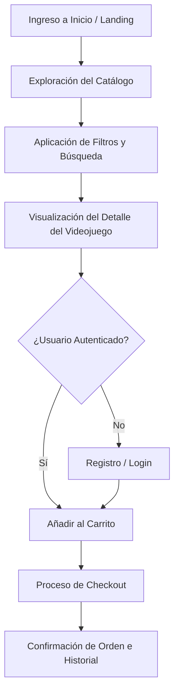

# Flujo de Usuario: 4Fun Store Web

Este documento describe el recorrido del usuario a través de la aplicación cliente, detallando los diferentes estados de la interfaz y la experiencia interactiva provista.

## Flujo de Navegación Principal

El sistema soporta un camino feliz transaccional desde el descubrimiento hasta la adquisición del videojuego digital:

### 1. Descubrimiento y Catálogo

- Al ingresar a la aplicación (`/`), el usuario visualiza las principales taxonomías y juegos recomendados.
- El acceso al catálogo completo (`/productos`) presenta una grilla reactiva con filtros laterales de plataformas y géneros.
- La barra de búsqueda implementa _debounce_ para optimizar las peticiones a la API REST. Los filtros se reflejan en la barra de direcciones de forma inmediata.

### 2. Detalle de Producto

- El usuario hace clic en una tarjeta y accede a `/productos/[id]`.
- Se despliega información ampliada del videojuego digital: descripción, imágenes, precio actual, stock y la plataforma de activación disponible (Steam, Epic Games, PlayStation Network, etc.).

### 3. Autenticación Integrada

- Si el usuario añade productos al carrito siendo anónimo, estos se guardan en el almacenamiento local del cliente (`localStorage`).
- Al proceder al pago o iniciar sesión desde el menú, es redirigido al formulario correspondiente (`/login` o `/register`).
- Una vez iniciada la sesión, las cookies HttpOnly quedan establecidas y el carrito local se puede sincronizar con el backend de manera segura.

### 4. Flujo de Compra (Checkout)

- En la vista del carrito `/cart`, el usuario revisa el resumen del pedido, ajusta cantidades (respetando los límites de stock) y confirma la transacción.
- La aplicación despacha la orden y redirige al panel de usuario o sección de historial de pedidos, completando así el flujo comercial del sistema.
